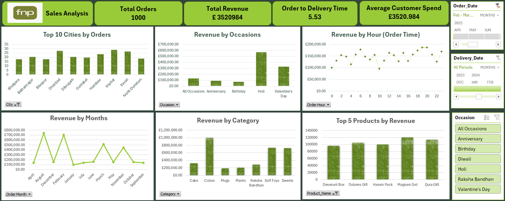

# Sales-Analysis-Excel

# Sales-Analysis (Excel)

## Problem Statement
Retail businesses often struggle to identify seasonal trends, high-performing products, and regional demand patterns. Without clear insights, inventory planning and stretegic marketing remain inefficient. 

This project focuses on the following business insights:
 
  - Identification of high-performing cities and products
  - Seasonal peaks and customer behavior patterns
  - Strategic recommendations for marketing and inventory planning

## Solution
A comprehensive sales performance analysis built in Microsoft Excel, featuring an interactive dashboard designed for quick insights and executive reporting. The dashboard visualises sales trends across regions, products, and time periods.

### Revenue Drivers

- Top Products: Quix Gift, Magnum Set, Delores Gift
- Top Category: Colors (dominates revenue share)
- Top Occasion: Holi, followed by Valentine's Day

### Geographic and Temporal Insights
- Top Cities: Imphal and Handwar
- Seasonality: Revenue peaks in December and February; dips in March, May, and June
- Order Time: Stable demand across hours

### Recommendations for business growth
- Prioritize inventory for Colors category and Holi-related products
- Target Imphal and Handwar with regional campaigns
- Investigate spring revenue dips to design seasonal promotions

### Dashboard Preview

## Key Features
**Top Metrics**: 
- Total Orders
- Revenue
- Delivery Time
- Average spend

**Visual Insights**:
- Top 10 Cities by Orders
- Revenue by Occasion (e.g., Anniversary, Birthday, Valentine's Day)
- Hourly Revenue Trends
- Monthly Revenue Trends
- Revenue by Category (Cakes, Plants, Mugs, Perfumes, Soft Toys)
- Top 5 products by Revenue

  **Interactive Filters**:
  - Order Date
  - Delivery Date
  - Occasion

  ## Tools & Technologies
  - **Microsoft Excel**: Data cleaning, pivot tables, slicers, and chart creation
  - **Power Query**: Transforming raw sales data
 
  ## Repository Contents
  - 'Sales Dashboard.png': Final dashboard snapshot
  - 'Executive Summary.pdf': Written summary of insights and recommendations
  - 'Sales Report.xlsx': Raw data, pivot tables and interactive dashboard
  - 'README.md': Project overview and usage guide
 

  ## How to Use
  1. Open 'Sales Dashboard.png' to explore the dashboard.
  2. Review 'Executive Summary.docx' for context and strategic takeaways.
  3. Use the Excel workbook to interact with filters and raw data.

  ## Author
  **Zubeen Khalid**
  MSc Applied Data Science, Anglia Ruskin University
  [LinkedIn](www.linkedin.com/in/zubeenkhalid)
