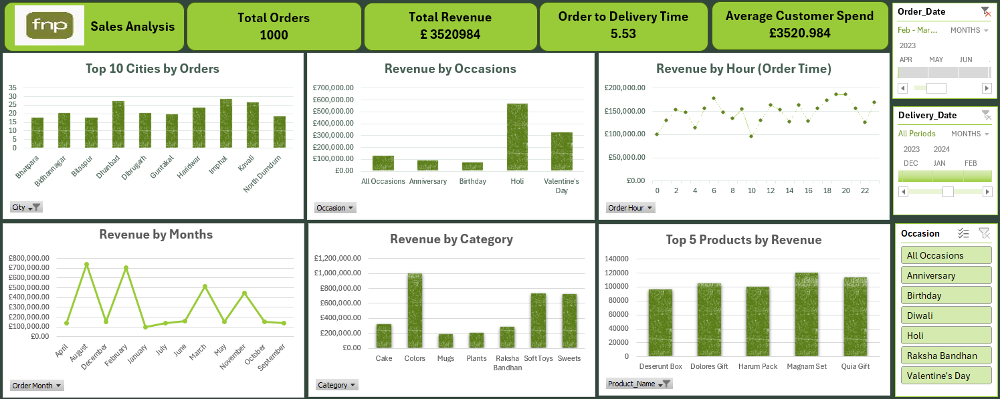

# Sales Analysis Dashboard
### Interactive Excel business intelligence dashboard across 10,000+ sales records

---

## At a Glance

| | |
|---|---|
| **Dataset** | 10,000+ retail sales records across products, cities and occasions |
| **Tools** | Microsoft Excel, Power Query, Pivot Tables, Slicers |
| **Output** | Interactive executive dashboard with filters by date, occasion and region |
| **Business focus** | Seasonal trends, top-performing products, regional demand, inventory planning |
| **Audience** | Non-technical stakeholders, designed for executive reporting |

---

## Overview

A comprehensive sales performance analysis built entirely in Microsoft 
Excel, featuring an interactive dashboard designed for executive 
reporting and quick business insights.

The project demonstrates how Excel's analytical toolset: Power Query 
for data transformation, pivot tables for aggregation, and slicers for 
interactive filtering can deliver production-ready business 
intelligence without specialist BI software.

---

## Dashboard Preview

---

## Key Findings

### Revenue drivers
- Top products: Quix Gift, Magnum Set, Delores Gift
- Top category: Colors (dominant revenue share)
- Top occasion: Holi, followed by Valentine's Day

### Geographic insights
- Highest order volume: Imphal and Handwar
- Regional concentration suggests targeted campaign opportunity

### Seasonal patterns
- Revenue peaks: December and February
- Revenue dips: March, May and June
- Hourly demand: Stable across all hours of day

### Strategic recommendations
- Prioritise inventory for Colors category and Holi-related products ahead of Q4
- Target Imphal and Handwar with regional marketing campaigns
- Investigate spring dip (March–June) to design seasonal promotions
  and reduce revenue gap

---

## Dashboard Features

**Key metrics**
- Total orders, total revenue, average delivery time, average spend per order

**Visualisations**
- Top 10 cities by order volume
- Revenue by occasion (Anniversary, Birthday, Valentine's Day, Holi, etc.)
- Monthly revenue trends with seasonal pattern identification
- Hourly revenue distribution
- Revenue by product category
- Top 5 products by revenue

**Interactive filters**
- Order date range
- Delivery date range
- Occasion type

---

## Technical Approach

**Data cleaning and transformation (Power Query)**
- Raw data ingested and transformed using Power Query
- Column standardisation, data type correction, and null handling
- Reproducible refresh pipeline, data updates propagate automatically to all pivot tables and charts

**Analysis (Pivot Tables)**
- Multi-dimensional aggregation across product, region, time and occasion
- Calculated fields for revenue per order and delivery time metrics
- Structured for drill-down from summary to transaction level

**Dashboard (Excel)**
- Slicers connected to all pivot tables for synchronised filtering
- Chart formatting aligned to executive reporting standards
- Single-sheet dashboard layout for presentation and PDF export

---

## Repository Contents

| File | Description |
|------|-------------|
| `Sales Dashboard.png` | Dashboard screenshot |
| `Executive Summary.pdf` | Written summary of insights and recommendations |
| `Sales Report.xlsx` | Raw data, Power Query model, pivot tables and dashboard |
| `README.md` | Project overview |

---

## Skills Demonstrated

`Microsoft Excel` `Power Query` `Pivot Tables` `Slicers` `Data Cleaning`  
`Dashboard Design` `Data Visualisation` `Business Intelligence`  
`Executive Reporting` `Seasonal Analysis` `Revenue Analysis`  
`Regional Analysis` `Inventory Planning` `Strategic Recommendations`  
`Retail Analytics` `Stakeholder Communication`

---

## How to Use

1. Open `Sales Dashboard.png` for an immediate view of the dashboard
2. Open `Sales Report.xlsx` to interact with slicers and filters
3. Review `Executive Summary.pdf` for full findings and recommendations

---

## Author

**Zubeen Khalid**
MSc Applied Data Science - Anglia Ruskin University
ISO 42001 Certified | AI+ Foundation | Prompt Engineering Level 1

[LinkedIn](https://www.linkedin.com/in/zubeenkhalid) · 
[GitHub](https://github.com/zubeen84)
